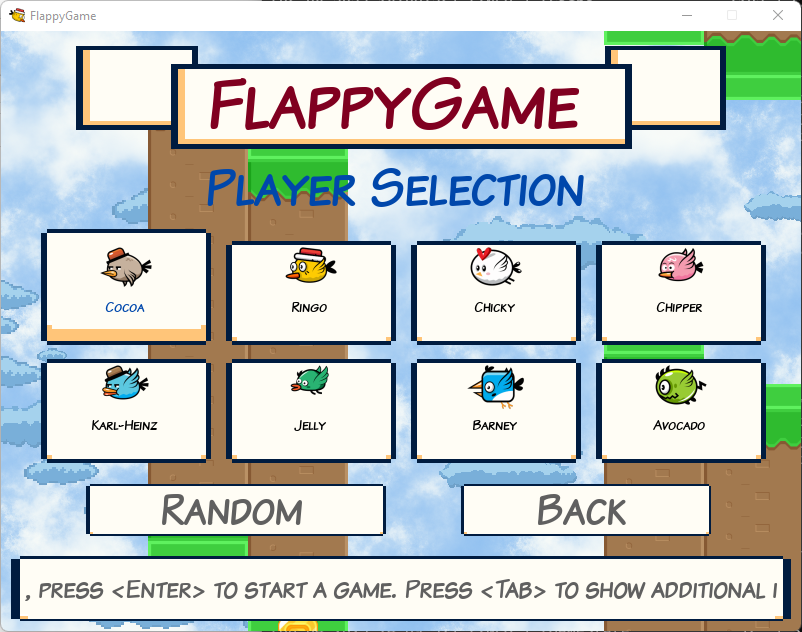
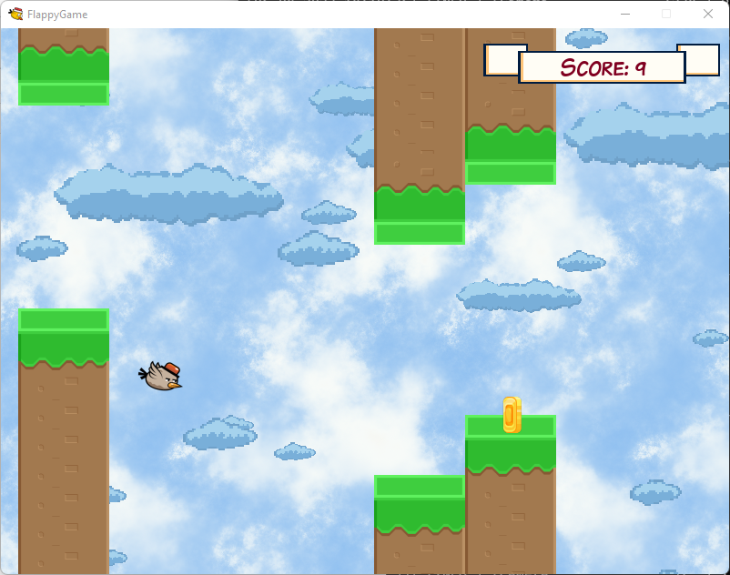
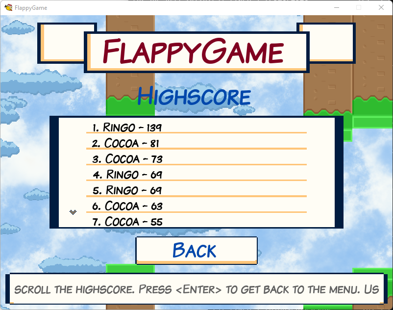

# FlappyGame

* A game where the player - one of eight birds - has to fly as far as possible while collecting coins
* Some of the lines are changing directions periodically
* Every bird has a slightly different behaviour
* Local highscore
* Options
    * Play in windowed or fullscreen mode
    * Two languages
        * English
        * German
* Keyboard and controller support

## Key mappings

* In options menu:
    * Press "-" on music/effects to decrease volume
    * Press "+" on music/effects to increase volume
* In player selection menu:
    * Press "Tab" or "-" to show/hide additional player information
* When in-game:
    * Press "Escape" or "Space" to pause game
    * Press "f" or "-" to display fps

## Controller mappings

The following controllers are supported:

* XBox 360
* Nintendo Pro

Mappings

* In options menu:
    * Press "L"/"LB" on music/effects to decrease volume
    * Press "R"/"RB" on music/effects to increase volume
* In player selection menu:
    * Press "L"/"LB" to show/hide additional player information
* When in-game:
    * Press "B" or "Start" to pause game
    * Press "L"/"LB" to display fps

## Screenshots

Player selection:  

In-Game:  

The highscore view:  

## Copyright

Copyright 2023-2025 Denis Meyer

## Attributions

### Button images

* "GUI Essential Pack" by Crusenho (https://crusenho.itch.io/complete-gui-essential-pack)

### Sprites

* "Seemless Sky Backgrounds" by Screaming Brain Studios (https://screamingbrainstudios.itch.io/seamless-sky-backgrounds)
* "Pixel Clouds" by GarzettDev (https://garzettdev.itch.io/pixel-clouds)
* "Super Flying Cat Popo" by judgemon21 (https://judgemon21.itch.io/super-flying-cat-popo-48x48)
* "Bat Sprites" by rentro-ghost (https://rentro-ghost.itch.io/bat-sprites)
* "Platform Game Assets" by bayat (https://bayat.itch.io/platform-game-assets)
* "Free Pixel Art Explosions" by CraftpixNet (https://free-game-assets.itch.io/11-free-pixel-art-explosion-sprites)
* "Rocky Roads" by Essssam (https://essssam.itch.io/rocky-roads)

### Font

* "Komika" by Apostrophic Laboratories (https://www.1001fonts.com/komika-font.html)

### Music

* Various sound effects by MixKit (https://mixkit.co/free-sound-effects/click/)
* Background and in-game background music "Abstraction" by Benjamin Burnes (https://abstractionmusic.com)
* "Coins 1" by ProjectsU012 (https://freesound.org/people/ProjectsU012/sounds/341695/)
